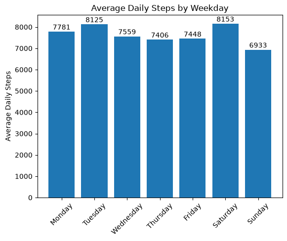
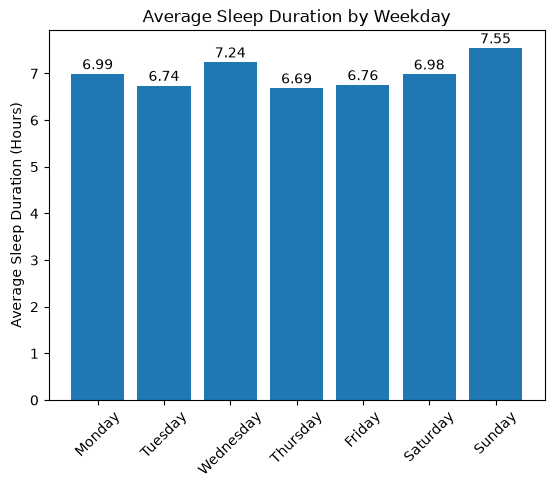
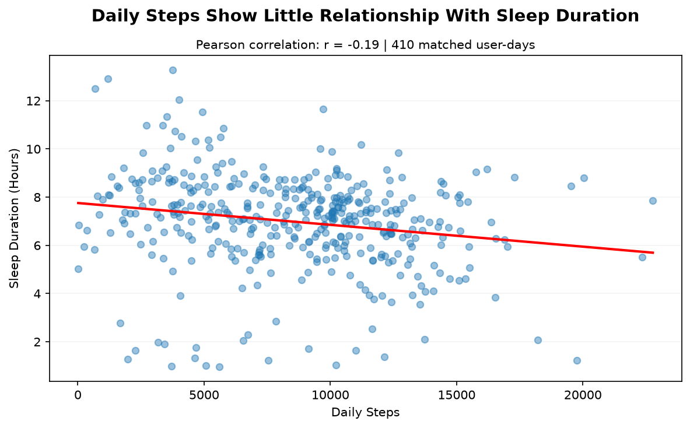

# Bellabeat Smart Device Usage Analysis

*Google Data Analytics Professional Certificate capstone | Python, pandas and Matplotlib*

## Project Overview

This case study analyses Fitbit smart-device data to identify activity and sleep trends that may be relevant to Bellabeat customers. The goal is to translate behavioural patterns into practical, high-level recommendations for the Bellabeat Time wellness watch.

The analysis focuses on daily activity and sleep data from **12 April to 12 May 2016**.

## Key Takeaways

- Daily activity was fairly stable across the week at roughly **7,000 - 8,000 steps**, but typical activity levels varied substantially between users.
- Average recorded sleep was around **7 hours**, with only modest differences between weekdays.
- Daily steps and sleep duration showed only a **very weak relationship (r = -0.19)**, so the analysis does not support a simple "more activity = longer sleep" message.

## Business Task

Analyse smart-device usage trends from Fitbit user data and consider how these trends may apply to Bellabeat customers. Use the insights from this analysis to develop high-level marketing recommendations for the Bellabeat Time wellness watch.

## Key Questions

- What patterns appear in daily activity?
- How does sleep duration vary across the week?
- Is there a meaningful relationship between daily step count and sleep duration?
- How could these findings inform Bellabeat's product and marketing strategy?

## Tools Used

- Python
- pandas
- NumPy
- Matplotlib
- Jupyter Notebook
- Git and GitHub

## Data and Scope

### Data Source

The analysis uses the **FitBit Fitness Tracker Data** dataset supplied for the Google Data Analytics Bellabeat case study. The dataset is hosted on Kaggle, was made available by **Mobius**, and is licensed **CC0: Public Domain**. It contains de-identified Fitbit activity and sleep records contributed by consenting users.

The source Fitbit dataset contains records collected across two periods between March and May 2016. This case study focuses on **12 April to 12 May 2016**, which provides directly comparable daily activity and daily sleep data for a consistent one-month analysis window.

The Fitbit records were collected in 2016, as supplied for this case study.

The final analysis uses:

- **940 daily activity records**
- **33 users with activity data**
- **24 users with sleep data**
- **410 cleaned daily sleep records**
- Daily step count (`TotalSteps`)
- Daily sleep duration (`TotalMinutesAsleep`)

**Source-count check:** the case-study description refers to 30 Fitbit participants, but the supplied April - May activity table contains **33 unique user IDs**. This project reports the counts observed in the files used rather than forcing them to match the case-study description.

The earlier March - April period also contains activity and sleep data, but its sleep file records each minute as **asleep, restless or awake** instead of providing a ready-made daily sleep-duration measure. To use it in the same analysis, those minute-level records would need to be aggregated and the mapping to a daily `TotalMinutesAsleep` measure would need to be confirmed. Rather than make that assumption, this project uses the later one-month period, where daily activity and sleep measures are already directly comparable. The earlier period could be revisited in a follow-up analysis once the metric definition is confirmed.

## Data Preparation and Quality Checks

Before analysis, the datasets were inspected for structure, completeness, duplicates, date formats and questionable observations.

Key preparation decisions included:

- Converting activity and sleep dates to datetime format
- Removing three exact duplicate sleep rows
- Reviewing unusually short sleep records and retaining them because there was insufficient evidence that they were data-entry errors
- Investigating questionable activity records, including zero-calorie days and records with unusually high sedentary minutes
- Some activity-intensity fields contained inconsistent values, so the main activity analysis focused on total daily steps

## Analysis

The project examined three main areas:

1. **Activity patterns** - average steps by weekday and variation between users
2. **Sleep patterns** - average sleep duration by weekday and differences in sleep-data coverage
3. **Activity and sleep relationship** - the relationship between daily steps and the sleep record carrying the same user/date. For this case study, that date is interpreted as the start date of the sleep period, so the comparison represents activity during that date and sleep beginning that night. This is treated as a pooled exploratory user-day analysis.

## Key Findings

### 1. Activity Patterns

Average daily activity was relatively consistent across the week at roughly **7,000 - 8,000 steps**.

- Tuesday and Saturday had the highest weekday averages, both above 8,000 steps.
- Sunday had the lowest average at roughly 6,900 steps.
- Individual activity levels varied substantially: 25% of users averaged below roughly 5,500 daily steps, while the top 25% averaged above roughly 9,500.

This suggests that stable overall weekday averages can hide meaningful differences between individual users.

### 2. Sleep Patterns

Average sleep duration was relatively consistent across the week, with modest weekday differences.

- Sunday recorded the highest average sleep duration at approximately **7 hours 33 minutes**.
- Thursday recorded the lowest at approximately **6 hours 41 minutes**.
- Sleep-data coverage varied considerably between users, so weekday sleep averages should be interpreted cautiously.

### 3. Steps vs Sleep Relationship

Daily steps and sleep duration showed a **very weak negative correlation (r = -0.19)**.

Although higher-step days were associated with slightly shorter sleep durations in this dataset, the observations showed substantial variation. The analysis therefore does not provide strong evidence of a meaningful linear relationship between daily steps and sleep duration.

This is an association only and should not be interpreted as causal.

  

## Recommendations

### 1. Personalised Activity Goals

Bellabeat could use each user's recent activity history to set personalised step goals and progress benchmarks rather than relying on one generic target.

Because activity levels varied considerably between users, this would make goals more relevant to each user's baseline and allow targets to adapt as behaviour changes over time.

Marketing could position Bellabeat Time as a wellness watch that adapts to the user's own activity baseline rather than promoting one target for everyone.

### 2. Encourage Consistent Sleep Tracking

If Bellabeat sees similar gaps in its own current user data, it could encourage more regular sleep tracking through reminders and educational messaging explaining how complete data supports more meaningful personalised insights and trends.

This could include in-app or wearable reminders when sleep data has not been recorded consistently. Marketing could also communicate that consistent overnight use helps Bellabeat Time provide more useful personal sleep trends.

### 3. Keep Activity and Sleep Messaging Separate

The weak relationship between daily steps and sleep duration suggests Bellabeat should avoid marketing messages that imply a simple connection between being more active and sleeping longer.

Instead, activity and sleep should be treated as separate wellness behaviours with distinct goals, insights, and recommendations.

## Limitations

- **Small sample size:** activity data covers 33 users and sleep data covers 24 users.
- **Short observation period:** the main analysis covers roughly one month.
- **Incomplete and questionable records:** user coverage varied considerably, particularly for sleep, and some unusual observations could not be confidently classified as errors.
- **Limited demographic information:** age, gender, location and other demographic characteristics are unknown, limiting how confidently the findings can be generalised to Bellabeat's customer base.
- **Unequal user contribution:** users contributed different numbers of recorded days, particularly for sleep, so the pooled activity - sleep correlation gives more weight to users with more matched records.
- **Historical dataset:** the Fitbit data was collected in 2016. In a real business setting, I would want current user data before using these findings to guide marketing decisions in 2026.

## Conclusion

The analysis found that average activity and sleep patterns were relatively stable across the week, while individual activity levels varied widely and sleep-data coverage differed considerably between users.

Daily steps and sleep duration showed only a very weak relationship. For Bellabeat, the clearest opportunities are to personalise activity goals, encourage more consistent sleep tracking, and keep activity and sleep messaging separate rather than implying a simple relationship between the two.

## Reproducing the Analysis

The raw Fitbit CSV files are stored locally in the project's `data/raw/` folder but are excluded from GitHub using `.gitignore`.

The completed Jupyter notebook is included in this repository and can be viewed directly on GitHub, including the saved code, outputs and visualisations.

To reproduce the analysis after cloning this repository:

1. Download the **FitBit Fitness Tracker Data** used in the Bellabeat case study.
2. Place `dailyActivity_merged.csv` and `sleepDay_merged.csv` inside:
   `data/raw/fitbit_2016-04-12_to_2016-05-12/`
3. Open `notebooks/bellabeat_analysis_final.ipynb`.
4. Restart the kernel and run all cells.

The notebook uses cross-platform `pathlib` paths, so the same project structure can be used on Windows, macOS or Linux.

## Full Analysis

The complete Python analysis, data-quality checks, code, visualisations and interpretation are available in:

[`notebooks/bellabeat_analysis_final.ipynb`](notebooks/bellabeat_analysis_final.ipynb)